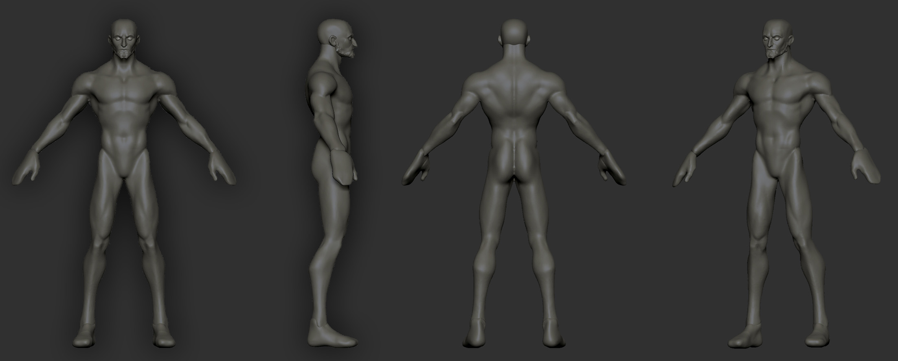

Recently, I started a new 3D character art class - **STYL**, at the Russian-speaking [XYZ school](https://www.school-xyz.com/).

It's a 6-month long program, where I will learn how to create a game-ready stylized character, taking it through the entire 3D pipeline - all the way from a ZBrush block-out to the in-game low-poly model (even with some animation to top it off!).

I've always wanted to learn how to create 3D characters for videogames. I have some experience with ZBrush, Maya, and the like; but never to this extent - so I thought it would be a good place to advance my skills further.

I wanted to use this blog as a place to document my progress, to see how far I can advance during the next 6 months!

### Choosing a concept

The first stage in this process was to pick a character concept to work from. While I had the option to create my own design, I think this would be a time-consuming undertaking in itself if I wanted it to be done well. Since my time in class is limited, I opted to work from another artists' concept instead.

The main thing that went into my consideration was complexity (I wanted to keep it relatively simple for my first character) and compatibility with the course - so I made sure that all of the elements of the character outfit were in some way covered by the course material, at least at a basic level.

As such, instead I took a browse through Artstation, and found [this](https://www.artstation.com/artwork/PX4DB3) awesome concept from one of the students at W--ART:

### Getting references

Any artist knows, one of the most important stages to the success of your project is gathering some references before you dive in!

It takes time to find the right examples, but this time will prove to be well-spent when I'm working out how to go about making certain outfit details, and how to stylize the various elements of this chararcter.

I made my ref board using [PureRef](https://www.pureref.com/), and I will likely keep updating it as I keep working on the model. A lot of my references came from Overwatch character models - which is the level of stylization I'm aiming for.

For your interest, I uploaded the entire ref board as an image [here](refboard.png) - but beware, the image size is around ~30 MB!

### First coursework assignment

